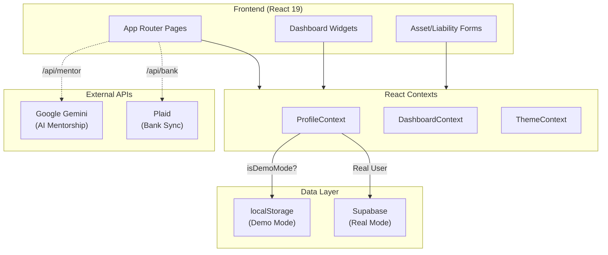

# Contributing to ClearWorth

This guide is for developers and AI agents working on ClearWorth.

## Quick Setup

### Prerequisites
- Node.js 18+ (LTS recommended)
- Git installed and configured
- Supabase account
- Google Gemini API key

### Installation
```bash
git clone https://github.com/ricafort/ClearWorth.git
cd ClearWorth
npm install
```

### Environment Configuration
Create `.env.local` in the root:
```bash
# Required
NEXT_PUBLIC_SUPABASE_URL="https://your-project.supabase.co"
NEXT_PUBLIC_SUPABASE_ANON_KEY="your-anon-key"
GEMINI_API_KEY="your-gemini-key"

# Optional (features mock if missing)
PLAID_CLIENT_ID="your-plaid-id"
PLAID_SECRET="your-plaid-secret"
PLAID_ENV="sandbox"
```

### Database Setup (Fresh Install)
1. Run `supabase_schema.sql` in Supabase SQL Editor
2. Verify RLS is enabled for all tables

### Verify Installation
```bash
npm run dev        # Should start on port 4000
npm run build      # Should complete without errors
```

---

## Architecture Overview



- **Framework**: Next.js 16 (App Router), React 19
- **Database**: Supabase (PostgreSQL)
- **Styling**: Tailwind CSS v4
- **AI**: Google Gemini API

### Key Directories
| Path | Purpose |
|------|---------|
| `src/app/` | App Router pages and API routes |
| `src/components/` | React components |
| `src/contexts/` | React Context providers |
| `src/lib/api/` | External integrations (Gemini, Bank/Plaid, Supabase) |
| `src/lib/data/` | Data access, storage, and demo profiles |
| `src/lib/domain/` | Pure business logic and calculators |
| `src/lib/utils/` | Shared utilities and helpers |
| `src/lib/registry/` | Configuration registries (Widgets) |
| `openspec/` | Specifications and change proposals |

---

## Critical Gotchas

### 1. Demo Mode vs Real Mode
- **Demo Mode**: Triggered by `?simulatedProfileId=...` URL param
- **Admin**: Users with `profile.role = 'admin'`
- The Welcome Modal is hidden for Admins and Demo simulations

### 2. Data Fetching Pattern
- **Client Side**: Use `src/utils/supabase/client.ts`
- **Server Side**: Use `src/utils/supabase/server.ts`
- Prefer Server Actions for mutations, Supabase Client for reads

### 3. Environment Variables
| Variable | Required | Notes |
|----------|----------|-------|
| `GEMINI_API_KEY` | Yes | App crashes without it |
| `NEXT_PUBLIC_SUPABASE_*` | Yes | Required for everything |
| `PLAID_*` | No | Uses mock mode if missing |

---

## Development Conventions

- **Files**: PascalCase for components (`BankCard.tsx`), camelCase for utils
- **Imports**: Use `@/` alias for src root
- **Components**: Use `'use client'` only when hooks/interaction needed
- **Verification**: Always run `npm run build` before submitting changes

---

## Troubleshooting

| Error | Cause | Fix |
|-------|-------|-----|
| "Failed to fetch" | Wrong Supabase URL | Check `.env.local` |
| "Gemini Key Missing" | Missing API key | Add `GEMINI_API_KEY` |
| "useSearchParams" build error | Missing Suspense | Ensure latest commit |

---

## See Also
- [README.md](README.md) - User-facing project overview
- [openspec/project.md](openspec/project.md) - Detailed internal spec
