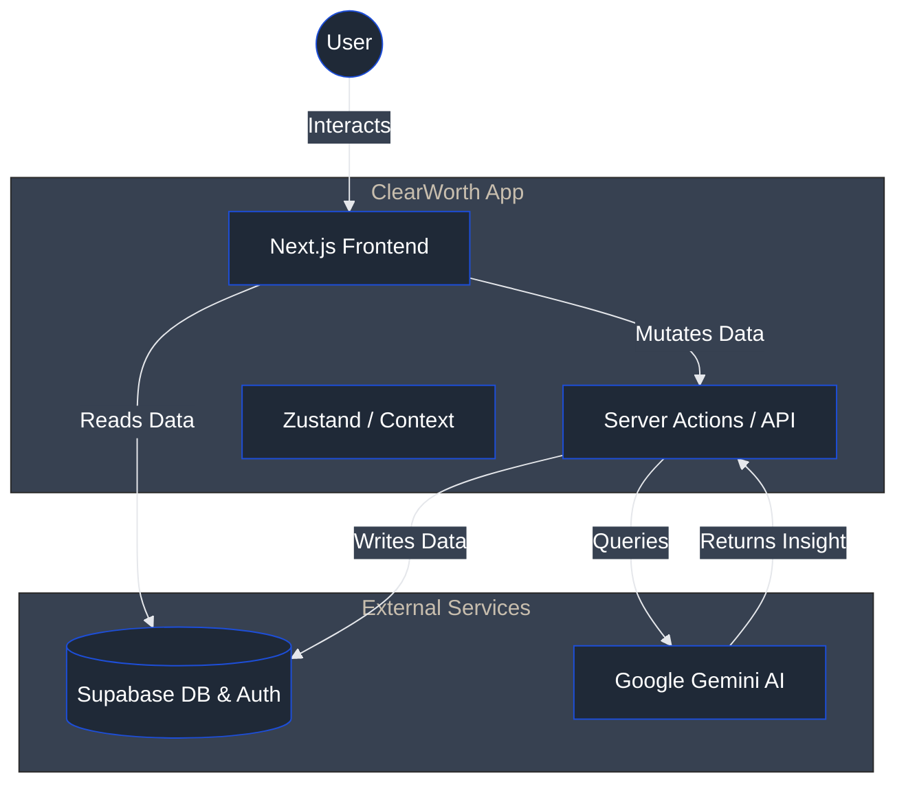
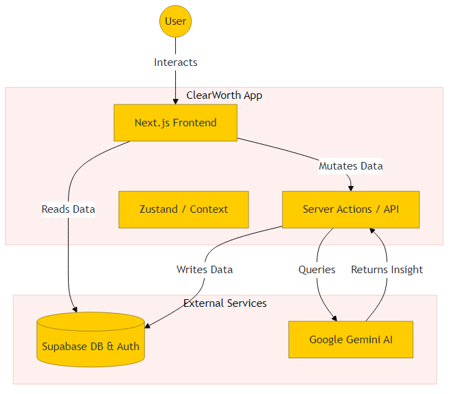
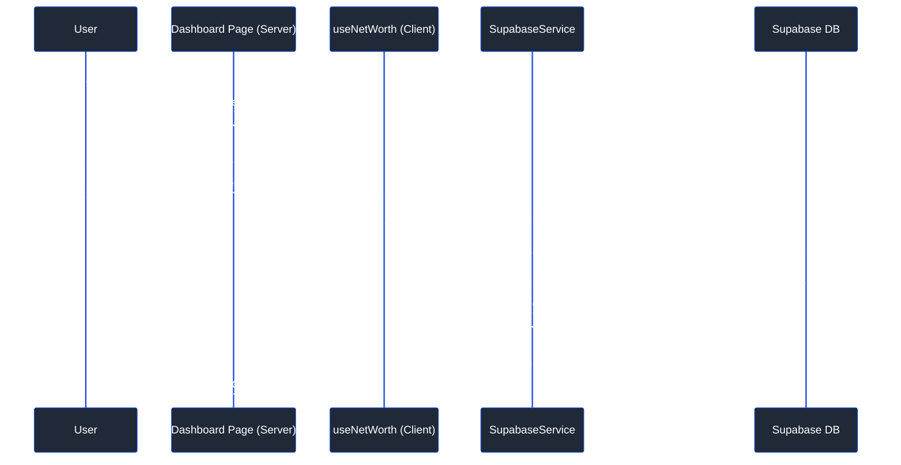
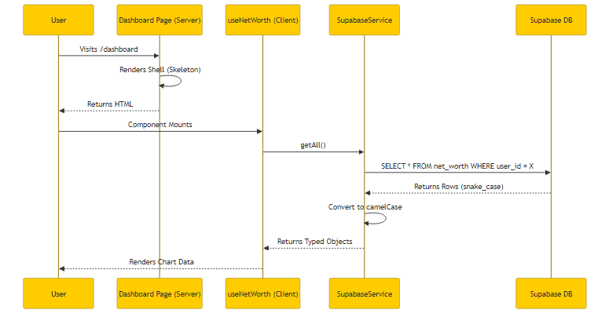

# ClearWorth Project Masterclass

Welcome to the **ClearWorth Project Masterclass**. This document is designed to take you from "knowing the code exists" to "understanding the architectural soul" of the application.

We chose this stack (Next.js, Supabase, Tailwind) not just because it's popular, but because it allows for rapid iteration without sacrificing type safety or scalability.

---

## 🏗️ Architecture Deep Dive

ClearWorth follows a **Modern Monolith** pattern using Next.js App Router.
-   **Frontend**: React Server Components (RSC) for initial load, Client Components for interactivity.
-   **Backend**: Server Actions for mutations, Supabase (PostgreSQL) for persistence.
-   **AI**: Direct integration with Google Gemini via server-side API calls.

### System Context (C4 Container)

This diagram shows how the user interacts with the system and how ClearWorth integrates with external services.

---

## 🧠 Core Concepts & Best Practices

### 1. The "Service Pattern" in TypeScript
Instead of writing raw SQL or database calls inside our UI components, we utilize a **Service Pattern**.
*   **Why?** It decouples the database logic from the view logic. If we switch from Supabase to Firebase, we only change the Service, not the components.
*   **Example**: Check out `src/infrastructure/SupabaseService.ts`. You'll see it implements a generic `DataService<T>` interface.

### 2. Composition over Inheritance
In React, we prefer composing small components together rather than building massive "God Components".
*   **Why?** Reusability and clarity.
*   **Example**: `NetWorthChartWidget.tsx`. It acts as a container that fetches data and *composes* the `NetWorthChart` presentation component inside the `WidgetWrapper` container.

### 3. Server Actions for Mutations
We use Next.js Server Actions for form submissions and data updates.
*   **Why?** It eliminates the need for a separate API layer (like Express or standard REST endpoints) for simple internal operations. Type safety is preserved from the frontend form to the backend function.

---

## 🔍 Code Walkthrough

We have annotated several key files in the codebase with `// TUTORIAL:` comments to help you understand the specific implementation details.

### 1. The Data Layer (`src/infrastructure/SupabaseService.ts`)
This file demonstrates how we handle data persistence. Look for the generic class implementation `<T>` and how we handle `camelCase` (frontend) to `snake_case` (database) conversion automatically. This saves us from writing manual mapping code for every single entity.

### 2. The Presentation Layer (`src/features/dashboard/widgets/NetWorthChartWidget.tsx`)
This file shows how to build a dashboard widget. Notice the **Separation of Concerns**: the widget focuses on *data fetching* and *layout*, while delegating the actual *rendering* to the Chart component and the *styling* to the Wrapper component.

### 3. The AI Integration (`src/features/mentors/components/ChatInterface.tsx`)
This component is a pure **Presentational Component**. It takes in props and events, and outputs UI. It doesn't know *how* the AI answers are generated, it only knows *how to display* them. this makes it extremely easy to test or use in a Storybook.

---

## 🔄 Data Flow: Fetching Dashboard Data

Here is exactly what happens when a user loads their dashboard.

---

## 🚀 Next Steps

To continue your learning journey:
1.  **Modify a Widget**: Try changing the `NetWorthChartWidget` to show a different time range by default.
2.  **Add a Service Method**: Add a `getTopAssets()` method to `SupabaseService` and see generic types in action.
3.  **Create a Mentor**: Duplicate an existing mentor in `src/features/mentors/data` and give them a new personality.
