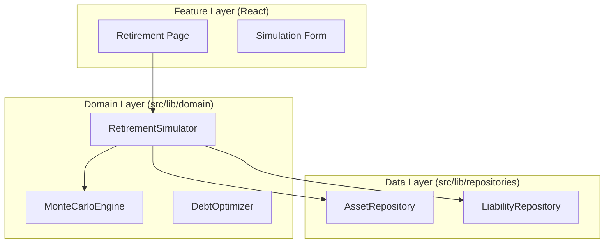

# Architecture Roadmap: The Domain Service Evolution

## 1. Current State: The Foundation (Tier 1)
**Status**: ✅ Implemented & Stable
**Pattern**: `Feature (UI/Hook) → Repository → Data Source (Supabase/Local)`

Our current architecture excels at **Data Management**.
- **Features**: Components like `AssetAllocationChart` or `DebtPayoffCalculator`.
- **Repositories**: `SupabaseAssetRepository` handles strict CRUD operations (Create, Read, Update, Delete) and acts as the gatekeeper for Demo vs. Real data.
- **Benefits**: Clean separation of data access, type safety, and isolated demo logic.

## 2. The Future: Domain Intelligence (Tier 2)
**Target**: 6-12 Months
**Pattern**: `Feature → Domain Service → Repository → Data Source`

As ClearWorth evolves from a "Tracker" to a "Financial Modeler," CRUD is no longer sufficient. We need a dedicated layer for **Financial Logic** that is independent of the UI and the Database.

### The "Why": Advanced Capabilities
We are introducing features that require complex, data-heavy computations:
1.  **AI Projections**: "If I invest $1k/mo, when do I hit $1M?"
2.  **What-If Simulations**: "What if the market crashes 20%?"
3.  **Debt Optimization**: "Show me the math for Avalanche vs. Snowball."
4.  **Retirement Modeling**: Monte Carlo simulations.

These features **consume** data (Read) and **produce** insights (Compute), but they don't always **persist** data immediately. They belong in the Domain.

### The New Logic Flow

1.  **UI** requests a "Retirement Projection".
2.  **RetirementSimulator** (Domain Service):
    - Calls `AssetRepository` to get current portfolio.
    - Calls `MonteCarloEngine` to run 1,000 simulations.
    - Returns the *result* to the UI.
3.  **Repositories** remain pure CRUD. They don't know about "Retirement," they only know about "Assets."

## 3. Implementation Strategy

### Phase 1: Preparation (Current)
- [x] **Strict Repositories**: Ensure Repositories DO NOT contain business logic (e.g., interest rate naming is fine, but "Debt Avalance Sorting" belongs in Domain).
- [x] **Pure Domain Functions**: We already have `src/lib/domain/debtCalculator.ts`. This is the seed of our Domain Services.

### Phase 2: Service Layer Introduction
- **Task**: Wrap complex Feature hooks into Services.
- **Example**:
  - *Current*: `useLiabilitiesQuery` fetches data, Component calculates payoff.
  - *Future*: `useDebtOptimization` calls `DebtOptimizer.calculateStrategy(liabilities)`.

### Phase 3: AI & Simulation Engines
- **Task**: Build pure TS classes/functions for heavy compute.
- **Location**: `src/lib/domain/engines/`.
- **Integration**: AI Agents (Mentors) will call these Services to ground their advice in math.

## 4. Final Verdict
This evolution moves ClearWorth from a "Data Entry App" to a "Financial Platform."
- **Testable**: You can unit test `RetirementSimulator` without a database.
- **Scalable**: Complex logic lives in one place, reused by the API, the UI, and the AI Agents.
- **AI-Ready**: LLMs need structured tools. Domain Services *are* those tools.
